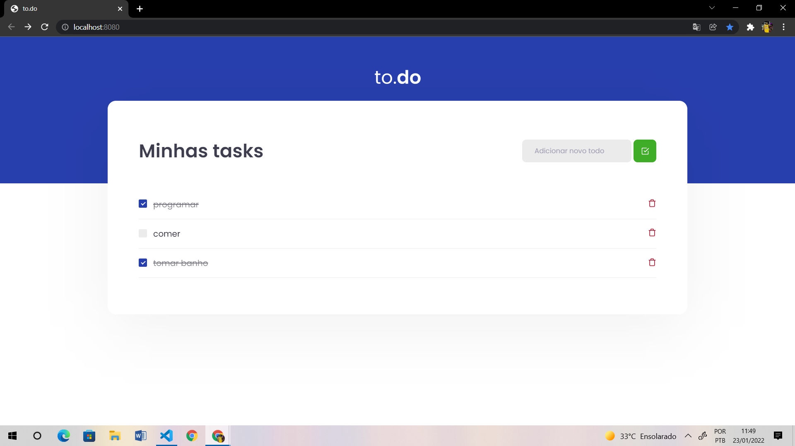

# Lista de tarefas (famosa to-do list) feita em React

## Funcionalidades da aplicação
- Adicionar uma nova tarefa
- Marcar ou desmarcar uma tarefa como concluída
- Remover uma tarefa

## Tecnologias utilizadas
- React 
- Typescript

## Habilidades desenvolidas
- Utilização do hook useState
- Tipagem de componentes com o Typescript

## Como executar
- Clone o repositório
- Abra a pasta dele no terminal e digite o comando ```yarn``` para instalar as dependências
- Execute o comando ```yarn dev``` e pronto, a aplicação estará rodando na sua máquina!

<br><br>

